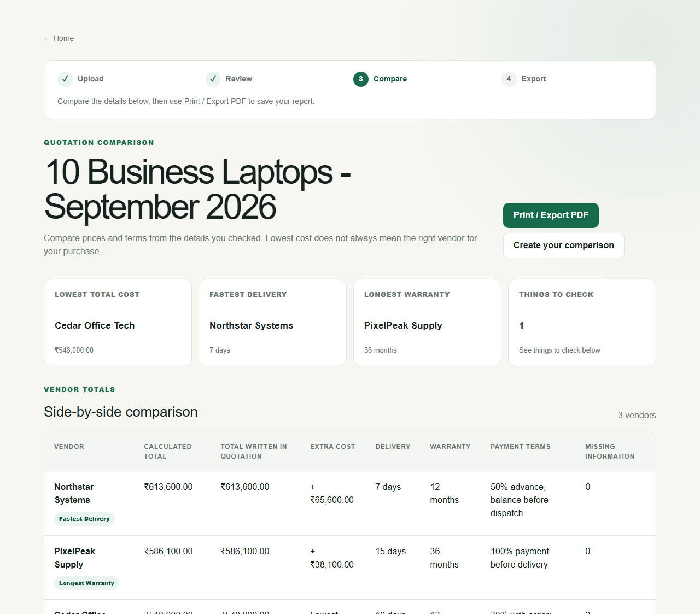

# QuoteLens AI

QuoteLens AI helps businesses compare vendor quotations in one place. Upload PDF or image files, check the details, compare total costs and terms, then print or save the report as a PDF.

**Upload → Review → Compare → Export**

AI reads the different document layouts so users do not have to copy every detail by hand. People review those details before deterministic TypeScript calculates the totals. QuoteLens highlights factual differences; it does not choose a vendor for you.

## Why I built it

Supplier quotations rarely share a layout or even describe tax, shipping, discounts, warranty, and delivery consistently. A quote with the lowest unit price can cost more after those terms are included. QuoteLens creates one reviewable workspace without pretending that AI should make the purchasing decision.

## Demo

Run the project and open [`/demo`](http://localhost:3000/demo) for a credential-free comparison built from three fictional laptop quotations. The matching source documents are in [`examples/quotations`](examples/quotations).



## How it works

1. **Upload:** start a comparison and add 2–5 quotations. Choose **Read Quotation** for each file.
2. **Review:** check vendor details, products and prices, taxes and charges, delivery and warranty. Correct anything that looks wrong, then confirm each quotation.
3. **Compare:** see calculated totals, the totals written in each quotation, extra costs, and things to check.
4. **Export:** use **Print / Export PDF** to save or share an A4 report.

The app shows the current step and what to do next. See the [user-flow guide](docs/USER_FLOW.md) for the complete walkthrough.

```text
Quotation PDF/Image
        ↓
Gemini factual extraction
        ↓
Zod-validated JSON + human verification
        ↓
Deterministic minor-unit pricing engine
        ↓
Side-by-side factual comparison
```

1. A user signs in and creates a comparison.
2. Two to five PDF, PNG, JPG, or JPEG files are validated and saved in private Supabase Storage.
3. A server action sends the private document bytes to Gemini using `@google/genai` structured output.
4. The response must pass the quotation Zod schema before it is stored.
5. The user reviews and corrects the extracted fields.
6. Only verified JSON reaches the pricing and comparison modules.
7. The app shows comparable totals, terms, warnings, and source documents. It never declares a “best vendor.”

## Key engineering decisions

- **AI extracts; code calculates.** Gemini never performs final financial arithmetic or chooses a supplier.
- **Human review is mandatory.** Extracted JSON and verified JSON are stored separately.
- **Money uses minor units.** Totals, percentage discounts, tax, shipping, installation, and other charges are calculated as integer cents/paise after input conversion.
- **Incomplete quotes cannot rank as cheapest.** Missing essential values produce a null total and visible warnings.
- **Currencies are never silently converted.** Costs are compared only within compatible currency groups.
- **Documents stay private.** Storage paths are user-scoped and viewing uses short-lived signed URLs.
- **Structured responses are still untrusted.** Every Gemini response is parsed and validated with Zod.

## Tech stack

- Next.js App Router, React, TypeScript, Tailwind CSS
- Supabase Authentication, PostgreSQL, Row Level Security, and private Storage
- Gemini through the official `@google/genai` package
- Zod for extraction and review validation
- Vitest for unit and integration tests
- Playwright for browser-level demo coverage
- GitHub Actions for CI

## Local setup

Prerequisites: Node.js 22+, npm, a Supabase project, and a Gemini API key.

```bash
git clone https://github.com/manthan3502/quotelens-ai.git
cd quotelens-ai
npm install
cp .env.example .env.local
npm run dev
```

On Windows PowerShell, copy the environment template with:

```powershell
Copy-Item .env.example .env.local
```

Then:

1. Apply every SQL file in [`supabase/migrations`](supabase/migrations) in filename order.
2. Add `http://localhost:3000/auth/callback` to the Supabase Auth redirect allow list.
3. Fill `.env.local` with your Supabase public values and Gemini server key.
4. Open [http://localhost:3000](http://localhost:3000).

## Environment variables

| Variable | Exposure | Purpose |
| --- | --- | --- |
| `NEXT_PUBLIC_SUPABASE_URL` | Browser-safe | Supabase project URL |
| `NEXT_PUBLIC_SUPABASE_ANON_KEY` | Browser-safe | Supabase anonymous key; RLS still applies |
| `SUPABASE_SERVICE_ROLE_KEY` | Server only | Reserved for trusted administration; the v1 user flow does not use it |
| `GEMINI_API_KEY` | Server only | Gemini extraction requests |
| `GEMINI_MODEL` | Server only | Model override; defaults to `gemini-3.8-flash` |

Never commit `.env.local`. Never expose the service-role or Gemini key through `NEXT_PUBLIC_` variables.

## Scripts and testing

```bash
npm run typecheck
npm run lint
npm test
npm run test:e2e
npm run build
```

Unit and integration tests use mocked Gemini responses. CI never needs a real Gemini API key. The browser test opens the public fictional demo and does not require a Supabase connection.

## Architecture and security

- [Architecture](docs/ARCHITECTURE.md)
- [AI extraction design](docs/AI_DESIGN.md)
- [Security model](docs/SECURITY.md)
- [Deployment and release checklist](docs/DEPLOYMENT.md)
- [Milestone build plan](docs/BUILD_PLAN.md)

## Sample quotations

The public demo set contains fictional data in three formats and layouts:

- Northstar Systems - PDF, 18% GST extra, free shipping
- PixelPeak Supply - PNG, itemized GST and paid shipping
- Cedar Office Tech - JPG, tax-inclusive total with an unclear breakdown

Regenerate the samples with `python examples/quotations/generate_samples.py` when the fixture content changes.

## Deployment

Follow the [deployment checklist](docs/DEPLOYMENT.md) for the exact Supabase, Vercel, migration, environment, and smoke-test steps. The quotation bucket must remain private.

## Limitations

- Extraction accuracy depends on document quality and layout complexity.
- Handwritten, damaged, or unusually dense quotations may need substantial correction.
- The user must verify extracted values before relying on a comparison.
- The output is not financial, tax, procurement, or legal advice.
- v1 supports PDF, PNG, JPG, and JPEG files up to 10 MB each.
- v1 compares confirmed values within compatible currencies and does not fetch exchange rates.
- Server upload limits imposed by a hosting provider may require direct-upload architecture for larger future limits.
