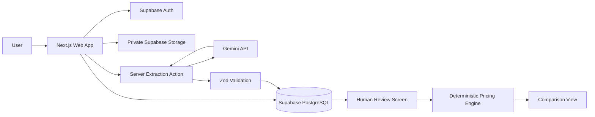

# Architecture

QuoteLens uses one Next.js application with Supabase for identity, PostgreSQL, and private document storage. There is no separate API service or calculation worker.

## Request flow

1. Supabase Auth places the user session in secure cookies. Server Components and actions call `auth.getUser()` before protected work.
2. The upload action verifies comparison ownership through Row Level Security, checks the batch limit, validates file metadata and signatures, then writes to a private user/comparison storage path.
3. Extraction downloads the file through the authenticated Supabase client and passes only the document bytes, MIME type, prompt, and JSON schema to Gemini.
4. The Gemini response is parsed and validated. Invalid JSON or schema output is stored as a failed extraction state rather than accepted.
5. Extracted JSON is displayed in an editable review form. Saving runs the same schema validation again and stores a separate `verified_json` value.
6. Pure pricing and comparison functions consume only verified JSON. They do not call Gemini or the database.

## Data boundaries

- `extracted_json` is machine-produced and never considered confirmed.
- `verified_json` is user-confirmed and is the sole input to calculations.
- `source grand total` remains distinct from `computed grand total`.
- Files are private. Authenticated short-lived signed URLs provide preview and download access.
- RLS policies scope profiles, comparisons, quotations, and storage objects to the signed-in user.

## Main modules

- `src/lib/ai/schema.ts`: extraction contract and TypeScript types
- `src/lib/ai/extractQuotation.ts`: server-only Gemini integration
- `src/lib/pricing/calculateQuote.ts`: minor-unit quote calculation
- `src/lib/pricing/compareQuotes.ts`: compatible-cost comparison and factual labels
- `src/lib/files/quotationFiles.ts`: upload limits, signature checks, and safe names
- `src/lib/supabase`: browser, server, and session clients
